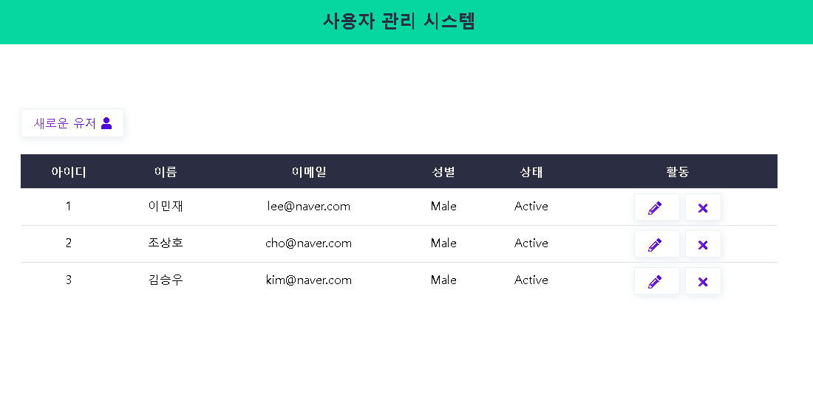

- 작성일: 2022년 2월 12일(토)
- Complete CRUD - - Application with Node, Express & MongoDB
- https://www.youtube.com/watch?v=W1Kttu53qTg&t=5548s

- html, css(반응형), js, jquery
- Node, Express, MongoDB
- 스크린샷 

- 느낀점: 라라벨 같은 프레임워크는 프로젝트 생성만 해도 기본 구조를 만들어주고 시작한다면 이번에 node.js로 crud 사용자 관리 시스템 만들기는 폴더와 파일들의 구조들을 하나하나 만들면서 어떻게 서로 코드가 연관되어 작동하는지 알 수 있는 기회였다. 프로그램 자체가 간단히 node.js로 crud를 경험하는 내용이지만 기본적으로 node.js가 어떻게 데이터를 처리해서 mongoDB와 연동해서 데이터 읽고 쓰고 삭제하고 수정하는지 알 수 있는 계기가 됐다.
